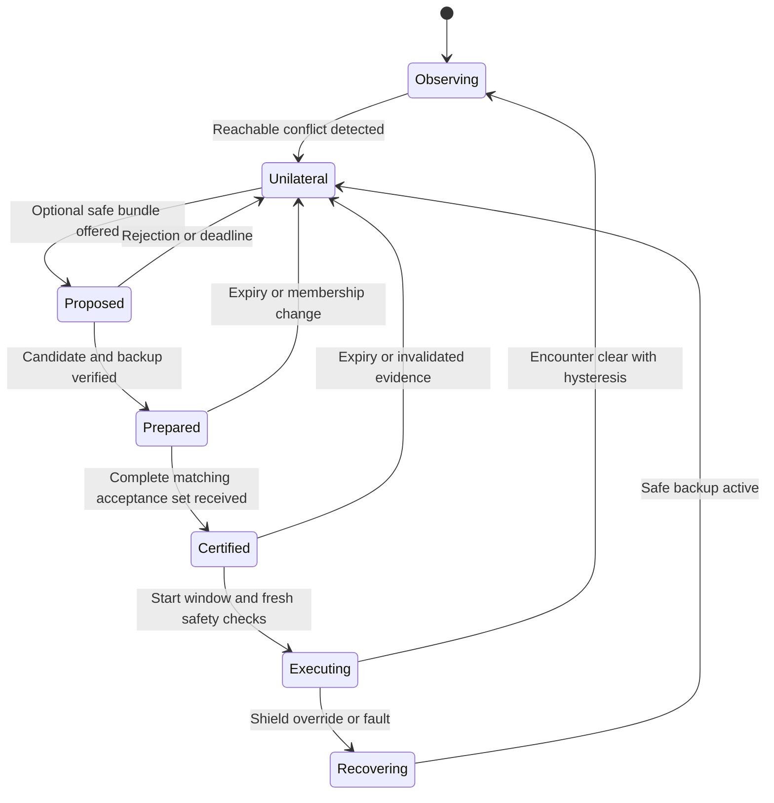

# Tactical negotiation protocol

This is a proposed versioned protocol, separate from ASTM RID and USS interoperability APIs. It routes optional maneuver agreements between equipped aircraft through USS brokers or authenticated direct links. It never sends a command to a legacy aircraft.

## Identities and message envelope

An authority-approved USS/operator registry binds tactical signing keys to aircraft sessions and operator identities. RID identifiers alone do not grant tactical authority. Aircraft capability claims include dynamic limits, controller/profile versions and allowed operating regions. Keys can rotate without resetting operator fairness history. Use mutually authenticated transports and end-to-end signatures, with authorized audience and purpose checks.

All signed messages include:

| Field | Meaning |
|---|---|
| `protocol_version`, `schema_hash` | Exact supported semantics and encoding |
| `message_id`, `type` | Unique idempotency identifier and message kind |
| `sender`, `key_epoch`, `session`, `sequence` | Signing authority, flight session and replay protection |
| `conflict_id`, `membership_digest`, `epoch` | Encounter and exact cooperative participant set |
| `created_at`, `clock_error`, `expires_at` | Bounded timestamp validity |
| `parent_digests`, `snapshot_digest` | Causal dependencies and decision inputs |
| `profile_hash`, `software_hash` | Safety/algorithm configuration |
| `payload_digest`, `signature` | Integrity of complete canonical message |

Use integer SI units for encoded trajectory samples/coefficients, an explicit coordinate frame/origin, deterministic serialization, and domain-separated message hashes. Reject missing units, unknown frames, nonfinite numbers, unsupported profiles, oversized messages and inconsistent time intervals. A signature covers the complete envelope and payload except the signature bytes. Retries reuse the original id and bytes; they cannot change a candidate under the same digest.

Clock-error bounds are checked locally. Receipt time never renews an expired source timestamp. Keep replay state for the authorized key/session lifetime, with persistent sequence checkpoints across reboot. Bound per-sender and per-encounter rates, and isolate decoding from the safety process.

## State machine

The safety loop operates in every state. `Prepared` creates a temporary reservation for local planning but never authorizes execution by itself. A certificate proves that all named participants signed the same bundle; it does not prove that each participant received the certificate or started the maneuver.

## Messages and obligations

| Message | Contents and effect |
|---|---|
| `CAPABILITY` | Signed capabilities and session binding; expires and can be revoked. |
| `PROPOSE` | Exact bundle of time-indexed trajectory tubes, costs, start/expiry window, fallback tubes, evidence hashes and epoch. No execution authority. |
| `ACCEPT` | One aircraft attests it checked its assigned prefix, relevant traffic and backup, and reserves its own trajectory for this epoch. |
| `REJECT` | Reason such as incompatible state, stale track, unsafe prefix, missing capacity, invalid priority or frame mismatch. |
| `CERTIFICATE` | Full matching acceptance set and exact proposal digest. Any authorized broker or participant can assemble it. |
| `STATUS` | Current measured state/enclosure, active contract digest and execution state. A received status is evidence, not assumed instantaneous truth. |
| `ABORT` | Signed cancellation reason; immediately advisory to others. Safety must tolerate its loss. |
| `OVERRIDE` | Safety intervention with prior contract, trigger, state enclosure, applied control and backup reference. |
| `COMPLETE` | Clearance evidence and released reservation; logging and burden updates remain independently verified. |

Legacy traffic participates only as track evidence. Its absence from membership does not remove it from the safety constraints.

## Bounded negotiation

Proposed simulation timing: planning at 10 Hz, a 100 ms decision epoch, at most two candidate rounds and a total 60 ms negotiation deadline. The remaining epoch budget covers initial fusion, final verification and publication. A proposer must finish within the same fixed deadline; retries do not extend it. Reject stale epochs and certificates received after their valid start window.

The initial cooperative negotiation cluster is limited to four aircraft and six candidates each, with a fixed search/time budget. The resulting finite search may still exceed its hardware deadline: publish a safe incumbent only if independently verified; otherwise use unilateral behavior. Bound signature verification and queue service as well as planning. These are proposed budgets requiring measurements, not claimed throughput.

Use an earliest-start interval with a guard exceeding validated clock skew, communication, verification and actuator delay. If the link cannot meet this guard, skip cooperative execution. A process uses monotonic local timers for watchdogs and recorded UTC intervals for cross-actor comparisons. Source RID data can be much slower than planning; each tick propagates its age rather than pretending a new measurement exists.

## Partial delivery and safe execution

Distributed atomic agreement cannot be assumed over lossy links. If A receives a certificate and B does not, B remains on its unilateral controller while A may begin its accepted candidate. To make this safe, every executing prefix must preserve backup viability for *all* relevant others' allowed physical controls. The initial safety profile never relies on B's promise to halve avoidance responsibility. A candidate that becomes safe only when B cooperates is rejected.

The onboard shield uses full physical acceleration envelopes for both cooperative and legacy traffic. Consequently, mixing execution, waiting, expiry and shield overrides remains covered by the same conditional safety proof. Candidate trajectory tubes improve conflict prediction and traffic flow; they do not tighten the collision barrier solely on the strength of a signature. This choice limits achievable density, especially with uncertain RID, but removes network agreement from the invariant's assumptions.

A future higher-capacity profile may narrow bounds only after proving a contract with bounded deviation detection, reaction delay, tracking error and compatible escape transitions. That separate proof must cover packet loss, partial start, emergency override and malfunction. It cannot infer compliance from an acknowledgment alone.

## Overlapping conflicts and federation

One aircraft has one active tactical trajectory digest for overlapping execution intervals. Local reservation checks reject a second conflicting acceptance, including one proposed by another broker. Any new epoch supersedes an old plan only through a verified transition from the current state. New traffic, membership changes or materially different evidence invalidate the pending bundle and trigger local revalidation.

Brokers exchange signed conflict digests and propagate the union of relevant traffic. They use epoch-bound ownership leases to avoid conflicting proposals, but lease ownership is an efficiency property. A partition, double leader or failed lease creates unilateral behavior and restrictions on new admissions. Safety must not depend on consistent global leadership.

Adjacent shards exchange a halo wide enough for the operating profile's detection and escape requirements. An aircraft retains both shards' traffic during handoff; it does not reset track age, uncertainty or encounter debt. A shard unable to demonstrate complete relevant coverage marks it unknown and restricts entry.

## Degraded cases

| Trigger | Required behavior |
|---|---|
| Missing proposal/acceptance/certificate | Continue unilateral safety; do not wait to avoid. |
| Stale RID or lost receiver | Enlarge reachable sets and revoke candidates that no longer pass; retain the threat. |
| DSS or USS outage | Use cached references for discovery only while valid; rely on local safety and the verified continuation/exit policy. |
| Track association conflict | Include all plausible physical hypotheses until resolved. |
| Candidate or nominal planner deadline missed | Discard expired command and use current verified backup/nominal safe incumbent. |
| Safety solver deadline missed | Independent watchdog switches to a backup certified for the present state enclosure. |
| No safe feasible control or backup | Declare loss of safety guarantee and use assessed emergency procedure; close admissions. |
| Audit uplink lost | Record locally and mark receipts pending; safety deadlines remain independent. |
| Audit storage exhausted | Restrict new cooperative agreements/admissions; keep safety running and signal evidence gaps. |
| Privileged priority spoofed | Reject privilege, retain aircraft as physical traffic, and log evidence. |

## Example transcript

1. Fusion detects that A, B and RID-only L may share a crossing. Both A and B already run unilateral avoidance.
2. Broker emits epoch 7 with A's staging maneuver, B's crossing maneuver, L's full reachable tube and backup references.
3. A and B independently verify their candidates against full motion bounds and all relevant tracks, then sign matching acceptances.
4. A receives the certificate; B loses it. A executes only through its safety shield. B remains unilateral. The accepted prefix must be safe in this combination.
5. L turns, expanding the conflict. A's shield rejects its nominal continuation and records an override. Lost abort messages do not invalidate B's local barrier protection.
6. Replay records exactly which actor received which message within its time bounds. No record claims that L agreed to anything.
