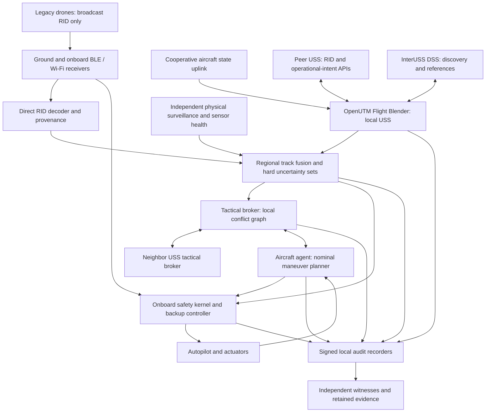

# Federated swarm architecture

## Scope and safety claim

**Recommendation:** use robust local collision avoidance as the safety authority and short, signed negotiations as an efficiency mechanism. Remote ID telemetry creates traffic observations; it does not create an obligation for another aircraft to yield. An aircraft can join independently and avoid broadcast-only neighbors without any change to those neighbors.

The intended operating domain is surveyed low-altitude airspace with bounded aircraft speed and acceleration, established surveillance coverage, known terrain and geofences, and participating aircraft able to execute a verified backup maneuver. Density is limited by reachable-set separation and backup feasibility, rather than a promise to handle an arbitrary number of drones in a fixed volume.

The conditional guarantee concerns each participating aircraft against all relevant *detected and bounded* traffic. It requires a viable initial state, correct uncertainty bounds, bounded sensing and actuation delay, sufficient control authority, and continued feasibility. It excludes undetected traffic, arbitrary spoofing without independent physical verification, adversarial motion beyond the declared physical envelope, and situations in which no collision-free maneuver exists. Two legacy drones may collide with each other; a USS cannot prevent that without control or responsive pilots. These limits define the safety case rather than a universal-adoption requirement.

All components and algorithms below are **proposed architecture**, except explicitly cited standards or upstream capabilities. The separation profile is a design input requiring operational validation; it is not an ASTM or regulator-approved minimum.

## 1. System topology and standards

### Standards boundary

| Interface or stack | Established role | Proposed use and boundary |
|---|---|---|
| ASTM F3411-22a | Broadcast and Network Remote ID formats, transmission and interoperability requirements | Observe identity and reported state. Preserve accuracy, timing, and source information; do not treat RID as a flight-control link. |
| ASTM F3548-21 | USS strategic coordination, conformance situational awareness, and constraint interoperability | Discover peer USSs, exchange operational-intent information, and update off-nominal intent. Tactical negotiation is a separate extension. |
| InterUSS DSS | Discovery and synchronization for RID and USS interoperability | Discover relevant providers and references; telemetry remains at providers. DSS is outside the onboard control loop. |
| InterUSS monitoring | Interoperability qualification tools | Test the relevant RID and strategic APIs; add separate tactical tests. |
| OpenUTM Flight Blender | USS backend with RID, traffic ingestion, strategic coordination and conformance services | Standards adapter and operator integration point. A new tactical broker and onboard safety kernel are required. |
| OpenDroneID core C | Broadcast RID encoding and decoding for Bluetooth and Wi-Fi | Decode radio observations at ground receivers and, where fitted, onboard receivers. |

F3411 describes identification rather than certified surveillance or collision avoidance. F3548-21 explicitly excludes tactical conflicts and does not establish equitable-access requirements; neither tactical safety nor this fairness policy can be claimed compliant merely by using its APIs. See the [ASTM RID scope](https://store.astm.org/f3411-22a.html), [ASTM USS scope](https://store.astm.org/f3548-21.html), [InterUSS DSS](https://github.com/interuss/dss), and [OpenDroneID](https://github.com/opendroneid/opendroneid-core-c).

Pin F3411-22a and F3548-21 for the initial interoperability profile. Explicitly negotiate API versions and validate mappings. InterUSS documents RID version-mixing pitfalls involving provider URL semantics; guessing a version from a URL can cause missed traffic. Verify licensed normative requirements and deployment rules separately from this design. [InterUSS version guidance](https://github.com/interuss/dss/blob/master/interfaces/rid/README.md).

### Federated topology

Each USS keeps its own operator relationships, authentication, missions, and records. Regional edge nodes route only nearby traffic and negotiations. Onboard safety remains available without the DSS, a regional leader, or a transparency-log service. That availability requires local sensing or a verified, time-bounded continuation/exit policy; stale ground tracks cannot sustain indefinite safe operation.

**Network path:** the RID provider registers an Identification Service Area with the DSS. An authorized consuming provider discovers relevant service areas, subscribes to changes, then queries provider USS flight endpoints. Those notifications concern discovery metadata, not a guaranteed high-frequency telemetry push stream. Where providers agree, a separate authenticated tactical feed can reduce latency while retaining the standardized RID interface. Rate limits, authorization, RID visibility limits and privacy restrictions still apply. [InterUSS discovery sequence](https://github.com/interuss/dss/blob/master/concepts.md).

**Direct path:** receivers pass raw Bluetooth/Wi-Fi frames to OpenDroneID decoding, timestamp them at reception, retain radio and receiver metadata, and emit attributed observations. A receiver can attest that it observed a frame; it cannot attest that an unsigned aircraft position is physically correct. Do not infer range from signal strength alone. Multiple receivers improve availability, but do not make self-reported positions independent measurements.

**Strategic path:** use F3548 operational-intent references, versions/OVNs, notifications, constraints, and conformance states through existing USS interfaces. After a tactical deviation, publish applicable conformance information and revise strategic intent using its required concurrency/version checks. Do not wait for a strategic API transaction before an imminent safety maneuver. A private tactical contract never substitutes for applicable operational authorization.

### Concrete OpenUTM integration

At the locally inspected Flight Blender revision, the telemetry router exposes `PUT /flight_stream/set_telemetry`, `PUT /flight_stream/set_signed_telemetry`, and `POST /flight_stream/set_air_traffic/{session_id}`. RID discovery and provider functions reside under `/rid`; operational-intent coordination lives in the SCD/USS modules. The repository also has Redis stream helpers and background RID processing. These are adapter boundaries, not measured real-time control guarantees.

Integrate a new edge feed beside those APIs: a decoder/fuser publishes normalized observations directly to a bounded local bus, while asynchronously submitting appropriate data to Blender. Celery, database commits, Redis retention, and RID display polling do not sit on the onboard safety deadline. Proposed transport: a bounded DDS or equivalent local feed and authenticated QUIC datagrams for fast remote updates; a reliable stream carries signed negotiation records. Deadline and authenticity validation apply regardless of transport.

Blender's documented deconfliction plugin evaluates flight declarations; its name does not imply a tactical actuator loop. Use its fuser and volume-generation extension points where appropriate, and build the tactical service separately. Confirm endpoint prefixes, schemas, authentication and plugin contracts against the deployed revision. The [upstream project](https://github.com/openutm/flight-blender) and [plugin guide](https://github.com/openutm/flight-blender/blob/master/PLUGINS.md) describe these integration capabilities; immutable local revision links are in [sources](sources.md).

### Track normalization and trust

Maintain a probabilistic estimator for efficient prediction and a separate **hard state enclosure** for safety. Normalize positions through WGS84/ECEF to a local ENU frame with a recorded origin and transform version. Preserve ellipsoid height, MSL, pressure altitude, and height above takeoff as distinct quantities until a validated conversion with bounded error is available. Unknown vertical reference means a broad vertical enclosure; it never means zero altitude error.

Every observation carries source identifier, receiver identifier, source time and its ambiguity, monotonic reception time, clock-error bound, frame/datum, position and velocity, accuracy indicators, authentication state, association hypotheses, sequence information if available, and a raw-message digest. Do not invent missing acceleration or transform reported accuracy categories into hard physical guarantees without validation. Resolve wrapped broadcast timestamps against reception and clock bounds; ambiguous or future timestamps widen the age interval or quarantine the report.

Associate Network and Direct observations using identity *and* time/kinematic consistency. Avoid double-counting retransmissions. Preserve ambiguous hypotheses and shared GNSS-error correlations; two transmissions from one navigation solution are not two independent sensors. Unknown IDs remain safety-relevant tracks. Treat conflicting duplicates as separate physical possibilities until resolved.

Cooperation class and observation integrity are orthogonal:

| Cooperation class | Allowed tactical assumption |
|---|---|
| Verified cooperative agent | May exchange signed candidates; physical uncertainty and deviation detection still apply. |
| RID-only aircraft | No acknowledgments or reciprocal avoidance assumed. Propagate all physically plausible motion. |
| Silent, stale, ambiguous or suspect aircraft | Retain an expanding reachable set and trigger surveillance/admission restrictions. Never delete a nearby threat solely because its beacon stopped. |

Broadcast authentication can be added for equipped aircraft using DRIP, but legacy unsigned traffic stays supported. DRIP authenticates a message's claimed signing identity; it does not validate its navigation solution. [RFC 9575](https://www.rfc-editor.org/rfc/rfc9575.html).

## 2. Algorithmic framework

### Separate decisions from safety

Use a partially observable stochastic game for independently operated cooperative agents. A common-reward training environment can be represented as a Dec-POMDP

\[
\mathcal M=(\mathcal I,\mathcal S,\{\mathcal A_i\},P,\{\mathcal O_i\},Z,R,\gamma).
\]

States include aircraft motion, uncertain intent, weather, sensor health, link delay and maneuver commitments. Actions are dynamically feasible short trajectory segments, with constraints on speed, acceleration, jerk and available airspace. Observations are local telemetry histories and messages; legacy drones are environmental actors with uncertain behavior, never policy-controlled agents.

A full online Dec-POMDP solution is unsuitable for a millisecond deadline. Use it to define offline training and evaluation, while deploying bounded deterministic candidate selection and receding-horizon planning. The decentralized-control complexity literature motivates avoiding an exact online solver. [Bernstein et al.](https://cics.umass.edu/~immerman/pub/bgiz.pdf).

### Local conflict graph and bounded planning

For each track, propagate a time-indexed occupancy tube over a proposed 5 s horizon. Create an edge when protected reachable tubes intersect. Use a spatial index only for conservative pruning: a track is removable from the safety neighborhood only if a certified lower-distance bound proves no intersection within the relevant horizon. Geographic shards overlap by the largest detection/escape margin, and crossing traffic is shared before it reaches a shard boundary.

Run nominal planning at 10 Hz and local safety at 50 Hz in the simulation profile. Generate a small, fixed maneuver library: continue, reduce speed, lateral alternatives, vertical alternatives only if allowed, and a validated escape/landing approach. Predict full dynamics rather than selecting instantaneous velocities unattainable by the aircraft. Terrain, structures, wake/downwash margins and geofences are part of feasibility.

A regional broker proposes compatible trajectories; each aircraft verifies its own candidate against the union of all relevant traffic tubes and its backup feasibility. Use a fixed candidate budget and a bounded number of negotiation rounds. Cooperative cluster-size limits restrict negotiation work only; the safety kernel continues to check all relevant tracks. If a dense connected component exceeds the validated solver capacity, suspend new admissions and serialize traffic through corridors or staging areas. Never meet a compute budget by discarding a nearby threat.

### Fair dynamic allocation

For a cooperative conflict cluster, let \(\mathcal F\) be the set of candidate bundles that pass independent safety checks. Define each participant's verified incremental cost

\[
c_i=\lambda_t\,\Delta t_i+\lambda_e\,\Delta E_i+
\lambda_m\,\Delta L_i,
\qquad
D_i^+=\rho D_i+c_i/s_i,
\]

where \(D_i\) is accumulated normalized maneuver burden, \(s_i>0\) is a published mission-class normalization, and \(0<\rho\le1\) limits the accounting window. Within the same authorized priority class, select lexicographically

\[
\min_{\mathbf a\in\mathcal F}
\left(\max_i D_i^+,\;\sum_i c_i,\;\text{published tie-break order}\right).
\]

This is the proposed bargaining rule: it makes repeatedly burdened operators less likely to yield when other safe alternatives exist, then minimizes total disruption. It provides an auditable policy, not a theorem of bounded delay under arbitrary overload. Mandatory emergency or right-of-way priorities precede burden balancing and never weaken collision constraints. Default and loss-of-connectivity behavior is conservative unilateral avoidance; eventual progress needs adequate free space and fair admission.

Costs and priority claims must be bounded and checked against aircraft capabilities and authority-issued credentials. Carry burden across sessions at the operator level with access-controlled accounting; a new RID identifier must not reset debt. Equal-class ties use an encounter ticket fixed at first detection and signed by the broker, with an identity-independent ordering policy. Cross-USS disputes use the published deterministic fallback ordering; disagreement prevents cooperative execution, not local avoidance. No monetary bids buy reduced separation.

Nash bargaining could alternatively maximize the product of benefit relative to each agent's *safe unilateral* disagreement policy. It is useful only if that baseline and a mutually feasible gain exist. The explicit burden rule is preferred initially because it is easier to replay and audit.

### Learning and reciprocity

Safe MARL is optional: train centrally in simulation with randomized density, legacy behavior, sensor errors and communication failures; execute a fixed policy locally to rank maneuver candidates or estimate performance costs. The learning policy cannot set uncertainty bounds, thresholds, actor membership, priorities, or actuator commands directly. The deterministic checker and shield validate every candidate and every applied control. Log policy version, observations and overrides; disable learning outside its validated domain. A reward penalty for collisions is not a safety proof.

Reciprocal velocity-obstacle heuristics may generate candidates for known cooperating agents. ORCA's shared-responsibility premise does not apply to RID-only aircraft, so legacy conflicts require the participant to plan unilateral avoidance of the full bounded obstacle tube. Shielding must still account for achievable accelerations and simultaneous interventions. [ORCA authors' description](https://gamma-web.iacs.umd.edu/ORCA/).

### Negotiation example

Aircraft A and B negotiate at a crossing while legacy drone L broadcasts toward it. L receives no proposal and owes no yield. Each participant expands L's reachable set and rejects any candidate that enters it. A can decelerate into a verified staging corridor while B passes, or both can divert if L's uncertainty blocks the crossing. The broker compares safe bundles using cumulative burden. If B misses an acknowledgment, A follows its unilateral safe plan. If L turns unexpectedly within the modeled envelope, both safety kernels can override the bundle immediately. Exact message semantics are in the [protocol](protocol.md).

## 3. Deterministic safety bounds

### Reachable sets and protected separation

Model each aircraft conservatively as \(\dot p_i=v_i\), \(\dot v_i=u_i+d_i\), with validated control and disturbance bounds. For an observation with age upper bound \(\tau\), a simple acceleration-bounded prediction enclosure is

\[
\mathcal P_j(t)=\hat p_j+\hat v_jt\ \oplus
\mathbb B\!\left(\epsilon_{p,j}+\epsilon_{v,j}t+
\tfrac12\bar a_jt^2\right),\quad t=\tau+s.
\]

Here \(s\) is future lookahead, \(\oplus\) is Minkowski sum, and \(\bar a_j\) bounds actual acceleration rather than a learned average. Include clock, datum, transformation, tracking and wind errors in the enclosing state/dynamics. A more accurate validated reachability model may reduce conservatism; a probabilistic confidence ellipsoid alone cannot supply a deterministic guarantee.

For every time in a candidate trajectory, inflated ownship and obstacle tubes must be disjoint. Account for rotor/body size, required operational separation, navigation error and intersample motion. Continuous swept-volume checks or verified interval enclosures are needed; checking only endpoints can miss a crossing.

### Robust higher-order control barriers

Acceleration-controlled aircraft make position separation a relative-degree-two constraint. A naive first-order position CBF does not directly constrain acceleration. For a constant-radius illustration, define \(r=p_i-p_j\), \(w=v_i-v_j\), and

\[
h=\|r\|^2-R_{ij}^2,\qquad
\psi_1=2r^Tw+k_1h.
\]

Require \(h\ge0\), \(\psi_1\ge0\) initially and impose

\[
\inf_{(r,w,u_j,d)\in\mathcal E_{ij}}
\left[
2\|w\|^2+2r^T(u_i-u_j+d)
+2(k_1+k_2)r^Tw+k_1k_2h
\right]\ge\eta_{ij}.
\]

The uncertainty set \(\mathcal E_{ij}\) covers state enclosure, other-aircraft acceleration and relative disturbance. \(\eta_{ij}\) supplies validated sample/hold, delay and numeric margins. For an uncooperative aircraft, the infimum uses its full physical motion envelope. For cooperative aircraft, the collision shield also uses the full envelope: signed promises alone never shrink this hard constraint. A tighter joint motion contract would require a separate assume-guarantee proof covering deviations and fallback transitions; it is outside the initial profile.

The safety filter solves

\[
u_i^*=\arg\min_{u_i\in\mathcal U_i}
\|u_i-u_i^{\rm nominal}\|_W^2
\quad\text{subject to all robust safety constraints.}
\]

The displayed robust problem is a specification, not automatically a QP. Use certified conservative affine lower bounds over the uncertainty set to obtain a QP; retain a robust convex solver if needed. Sampling a few disturbances is insufficient. Collision, terrain, control limits and invariant backup feasibility have no relaxation slack. Performance constraints can be softened. [CBF framework](https://arxiv.org/abs/1609.06408), [higher-order barriers](https://arxiv.org/abs/1903.04706).

Sampled-data invariance, time-varying radii, uncertainty-set updates, actuator tracking, simultaneous aircraft interventions and solver arithmetic each need explicit proof obligations. A trajectory proposal is admissible only if its executed prefix preserves access to a validated backup safe set. If the QP fails, the watchdog uses a previously verified backup valid from the current state enclosure. Hover, climb and land are not universally safe backups. If no verified backup applies, report loss of guarantee and execute the assessed emergency risk-minimizing procedure; do not label it collision-free.

### DAIDALUS and threshold profiles

Use DAIDALUS as a separate deterministic well-clear monitor and maneuver-band source where an applicable operating profile supports it, particularly for relevant manned-traffic encounters. Its core algorithms have a formal-methods foundation, but that does not certify this sensing chain, these urban trajectories, or the resulting flight-control integration. Do not transplant large-aircraft DO-365 thresholds into dense low-altitude drone traffic or arbitrarily shrink them and claim equivalent assurance. [NASA DAIDALUS](https://shemesh.larc.nasa.gov/fm/DAIDALUS/), [current code](https://github.com/nasa/daidalus).

Use versioned profiles for three distinct quantities: physical nonintersection, the chosen operational well-clear boundary, and early negotiation/alert thresholds. The hard collision layer and applicable well-clear constraints both take precedence over efficiency. Entry/exit hysteresis prevents alert chattering without reducing hard separation. The [safety case](safety-case.md) supplies proof conditions and an illustrative detection-distance calculation.

## 4. Verification and auditability

### Evidence integrity rather than absolute tamper proof

Each aircraft, gateway and broker records signed events before they leave its trust boundary. Store event type, signer and key epoch, per-signer sequence, previous-event digest, source/reception times with error bounds, conflict and proposal IDs, membership/epoch, parent-message digests, state-enclosure digest, raw evidence references, trajectory/backup digests, acceptance/rejection, solver result, applied command and measured conformance. Preserve algorithm, model, profile and software hashes.

Use deterministic encoding and domain-separated hashing. Each signer's hash chain establishes its local order; message references establish causal order across signers. Do not fabricate an exact global timestamp ordering when clock intervals overlap. Origin signatures distinguish aircraft assertions from gateway observations and broker decisions. An unsigned legacy transmission is logged as receiver-attested evidence only.

Regional recorders append event digests to Merkle transparency logs and issue signed inclusion receipts. Independent operators retain and exchange signed tree checkpoints and consistency proofs, making alternate histories detectable when witnesses compare views. Store encrypted raw evidence in separately administered retention-locked object storage; on the aircraft, use durable bounded recording with hardware-protected keys where available. Local sequence gaps, missing expected receipts and checkpoint conflicts become evidence events. This adapts transparency-log primitives rather than claiming a tactical logging standard. [RFC 9162](https://www.rfc-editor.org/rfc/rfc9162.html).

Tampering with retained signed records is detectable under uncompromised keys and at least one honest independent witness. Retention locks and replication resist deletion; hash commitments alone cannot restore deleted payloads. Colluding witnesses, compromised signers, false original sensor data, or events never captured defeat stronger claims. A hash chain without external checkpoints permits an attacker to replace an entire history. A blockchain transaction on every control tick adds no guarantee of sensor truth and creates an unnecessary dependency.

Recording is asynchronous to the safety loop. A lost audit uplink uses local buffering; depleted recording capacity triggers an explicit degraded mode and restriction on new cooperative negotiations/admissions. Safety control still runs. No critical maneuver waits for global consensus or remote storage.

### Trajectory deviations and responsibility evidence

An accepted maneuver contract binds signer identity, participant membership, exact trajectory tube, start/expiry interval, tracking tolerance, permitted shield overrides, backup behavior, profile and evidence snapshot. Pilot intervention, shield intervention, loss of link and physical trajectory departure are distinct events. A deviation is evaluated against a time-aligned measured enclosure: if the enclosure intersects the allowed tube, the evidence may be inconclusive; an enclosure wholly outside establishes observed nonconformance within its bounds.

Incident replay reconstructs what each actor could know at each decision, which proposal it signed, whether it received the necessary certificate before expiry, what control the shield permitted, and whether actuator response stayed inside tolerance. Replay identifies evidence for a software fault, missed deadline, false telemetry, operator intervention or broken maneuver promise. It does not mechanically assign legal liability; applicable law, contracts, duties and independent investigation determine that outcome. A safety override explains a deviation but does not automatically absolve every earlier decision.

Retention and access policies separate pseudonymous public checkpoint digests from encrypted operator and trajectory records. Preserve enough configuration and raw data for authorized replay without publishing pilots' locations or reusable identifiers. Key rotation and revocation retain historical key status and receipt evidence.

### Assurance and rollout

Model the negotiation state machine and partial-delivery cases formally, prove the safety-kernel obligations for a specified operating domain, and run reproducible mixed-equipage simulations before hardware-in-the-loop or controlled flight trials. Qualify standards adapters using InterUSS and OpenUTM tools; those suites do not prove tactical safety. The [verification plan](verification.md) maps each claim to required evidence.

Roll out in stages: telemetry-only observation; deterministic unilateral avoidance in simulation; cooperative negotiation in simulation; hardware timing and fault injection; supervised flight trials with validated coverage and density limits. Learning is a later candidate-ranking experiment. Increase operational density only after reachability, controller feasibility and detection/escape margins support it. Acceptance does not depend on legacy drones acknowledging the protocol.
