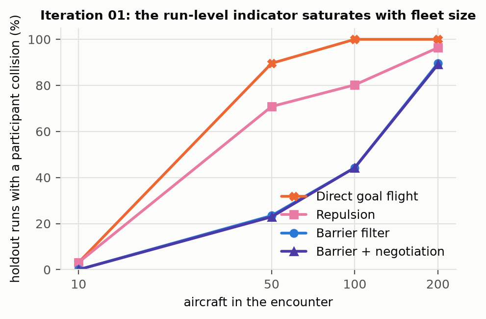
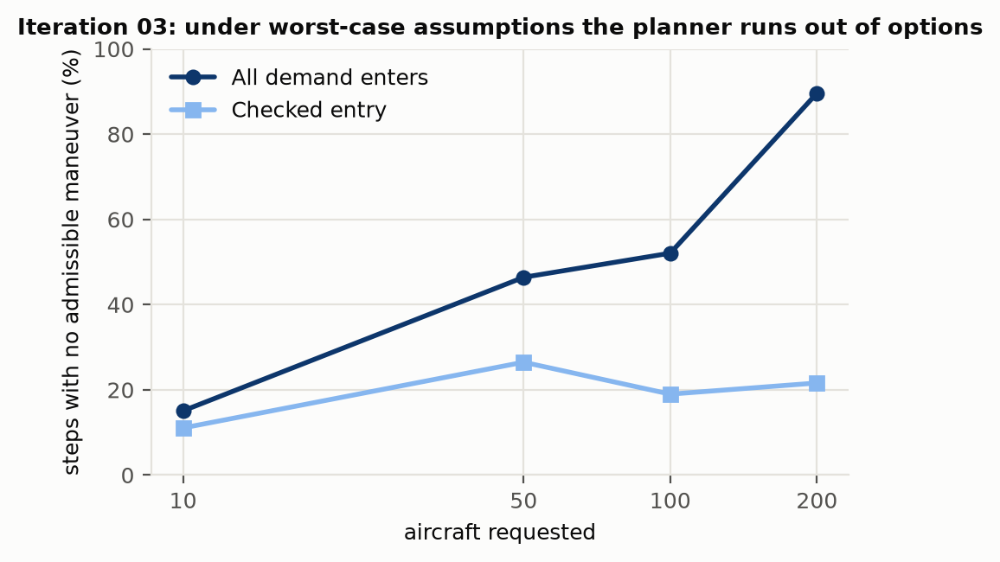
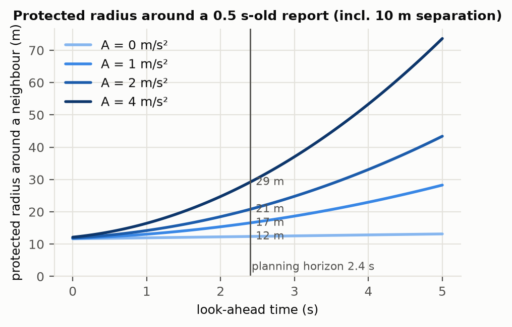
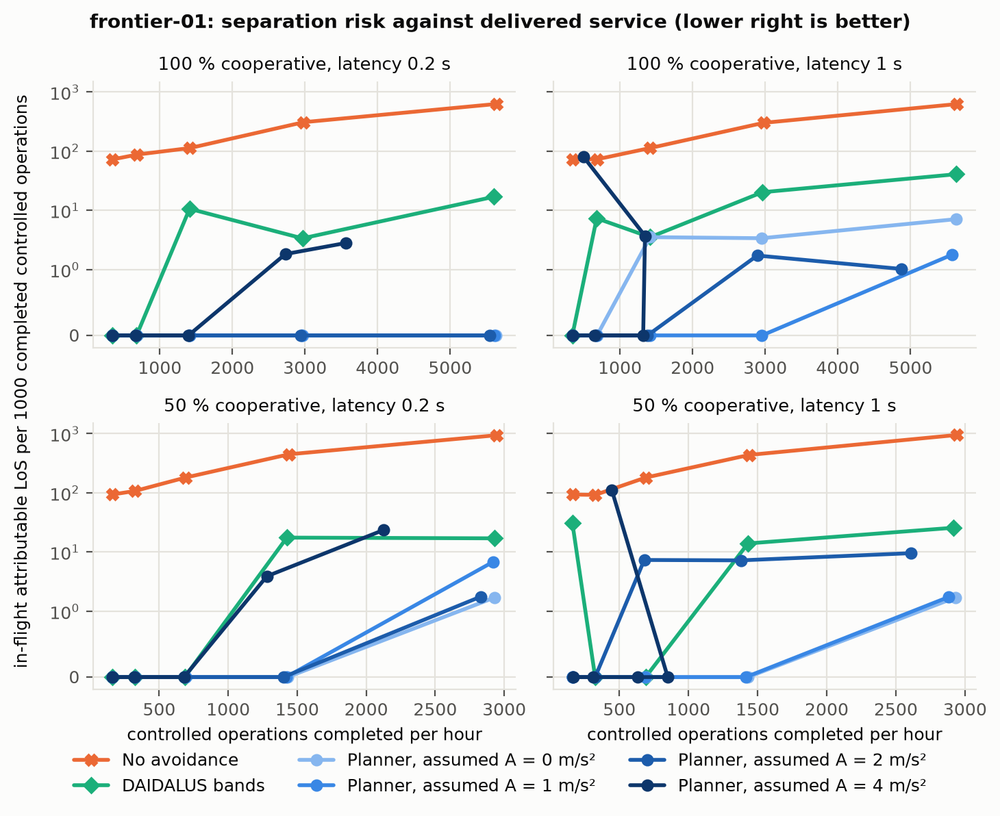
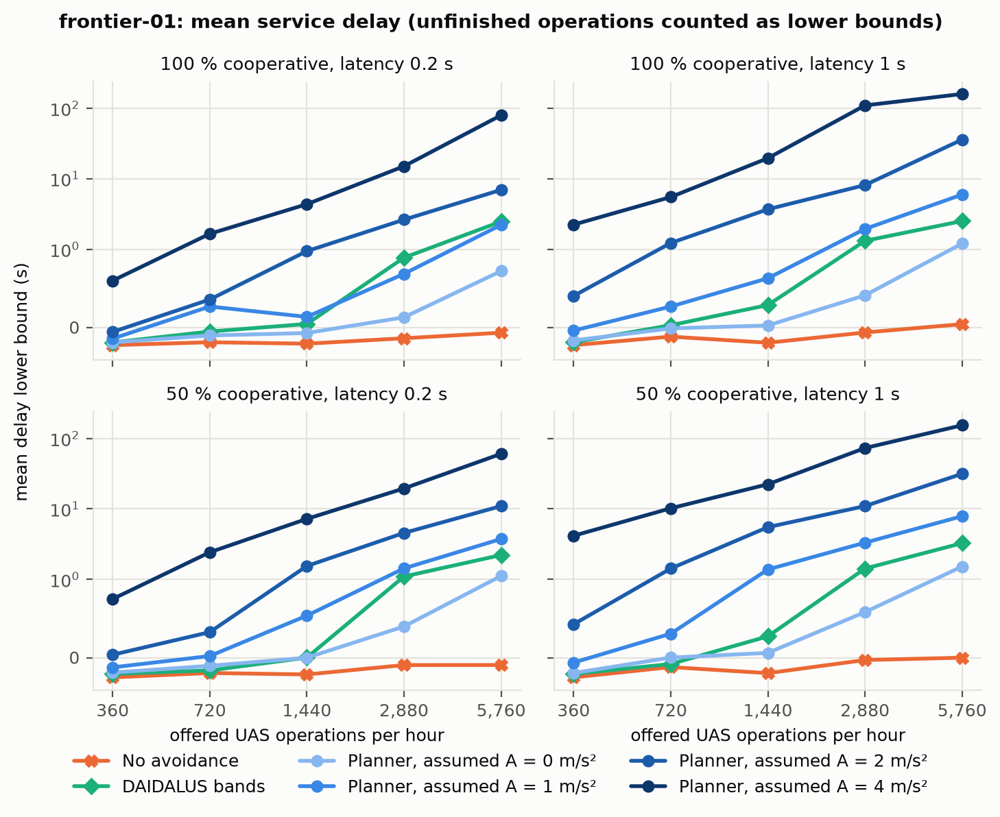
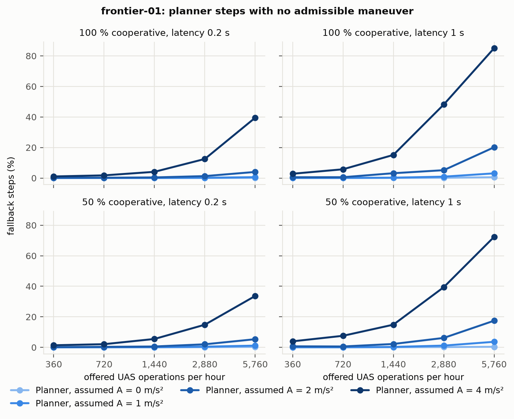
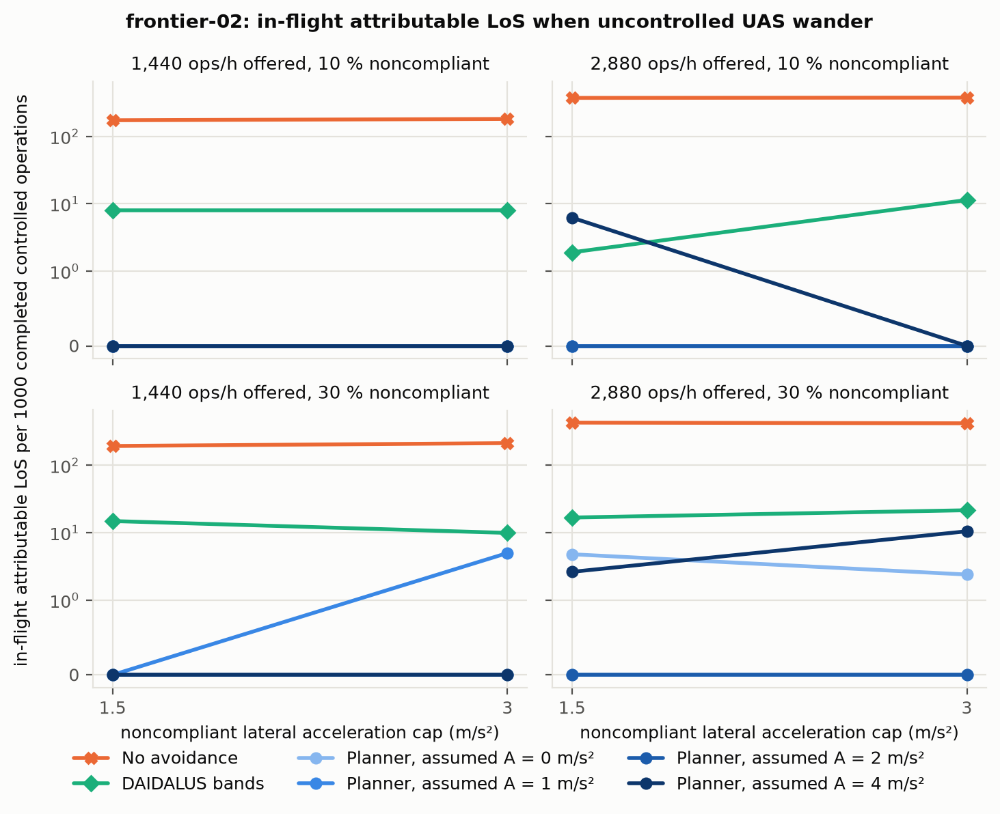

# Assumptions, not algorithms, set the density limit in simulation: a pilot safety–capacity frontier study of dense mixed-equipage UAS traffic

**Technical report, dense-uav-ops v0.5.0.** Vibhu Tripathi. October 2026.

## Abstract

We study how much low-altitude UAS traffic a tactical deconfliction system can serve at a given separation risk. The question is posed as a frontier between attributable risk and delivered service, not as a contest between controllers.

Reanalysis of 10,211 archived simulation runs from earlier versions of this project shows that their main limit was a modelling assumption, not the avoidance algorithms. Every planner assumed that any neighbour could accelerate toward it at full authority. Under the delayed surveillance assumed, that made each neighbour a sphere of roughly 30 m that had to stay clear, and the maneuver library ran out of admissible options on up to 90 % of controlled aircraft-steps at high density.

We built a single deterministic simulator in which the assumed traffic acceleration is an explicit parameter, decoupled from true vehicle authority. We then ran a pre-registered pilot sweep (frontier-01, 360 runs) that varies:
- the assumption (0–4 m/s²);
- offered demand (360–5760 operations/hour);
- surveillance latency;
- equipage.

The sweep is compared against a no-avoidance baseline and a NASA DAIDALUS direction-band baseline. In this model, a planner that assumes constant-velocity traffic and replans every 0.2 s gave the best observed frontier. It had 13 in-flight attributable losses of separation and no contacts in 60 runs (89 controlled flight-hours), with at most 1.5 s mean delay. The worst-case assumption bought no measurable risk reduction. Above 1440 operations/hour it lost up to 95 % of completions to congestion, and its unverified fallback maneuvers produced more contacts than any other planner setting. A follow-up stress test (frontier-02, 144 runs) with wandering noncompliant traffic did not change this. Measured deviations from constant-velocity prediction explain why: over the replanning interval the 95th percentile was at most 1.3 m. The worst-case model reasons open-loop over the whole horizon and ignores that aircraft replan.

All results concern a point-mass model with idealized ownship navigation and synthetic surveillance in one 400 m airspace cell. They show the shape of a trade-off. They are not operational rates, capacities or a ranking of safe systems.

## 1. Question and definitions

*For a declared operating domain, how much traffic can be served at a stated level of separation risk, and how does that depend on what aircraft assume about each other, surveillance, equipage and the avoidance method?*

Definitions follow [research-question.md](../research-question.md):
- A **loss of separation (LoS)** is a breach of 10 m between UAS (60 m with manned aircraft).
- A **contact** is overlap of body spheres.
- An event is **attributable** when at least one *controlled* aircraft is involved; controlled means equipped, cooperating and compliant.
- **Risk** is attributable in-flight UAS events per controlled flight-hour, and per 1000 controlled operations completed. Events within one report interval of an aircraft's entry are reported separately.
- **Service** is throughput, completion and delay. Delay is completion minus (request + nominal traversal time); unfinished operations count as lower bounds.
- **Capacity** is the highest tested demand meeting both a risk bound and service requirements, conditional on the domain.

We do not use "safest" or "proven" for simulation outcomes.

## 2. Historical evidence reanalysed

Six evidence sets from v0.1–v0.4 (10,211 evaluation runs) are retained unchanged. Each is validated against the exact source that produced it (`scripts/validate_evidence.py`). Two of them, previously only on the author's machine, were added: the 7,680-run iteration-01 campaign and the iteration-02 raw runs. Numbers below are computed by `scripts/reanalyze_history.py` into [`data/history.json`](data/history.json).

**2.1 The run-level indicator saturated, and the barrier filter's advantage came from leaving the airspace** (iteration-01, 7,680 runs).



The earlier ranking used the fraction of runs with any participant collision, pooled over fleet sizes 10–200. That indicator saturates: direct goal flight is at 3 % of holdout runs at 10 aircraft and 100 % at 100 and 200. The barrier-filter variants did have fewer collision runs at 50–100 aircraft (23 % and 44 % against 90 % and 100 %). However:
- at 50 or more aircraft, **every** barrier run had participating aircraft leave the operating volume (576 of 576);
- goal reach fell to 16 %, 6 % and 3 % at 50, 100 and 200 aircraft.

The reduction in collisions cannot be separated from aircraft leaving the airspace and not finishing their flights. The original decision correctly declined to call any controller acceptable. This analysis adds that the comparison could not have identified a safer controller in the first place.

**2.2 Under worst-case assumptions the planner runs out of options** (iteration-03, 948 runs).



The v0.3 planner protected each track by `e_p + e_v·τ + ½·(4 + 0.8)·τ²` over a 2.4 s horizon, with τ the report age plus look-ahead. That is about 33 m including separation for a 0.5 s-old report. The share of controlled aircraft-steps with **no admissible maneuver** rose with fleet size:
- 15 % at 10 aircraft, 46 % at 50, 52 % at 100 and 90 % at 200 when all demand entered;
- 11–26 % with checked entry, which in turn withheld or delayed demand.

The share is approximate: the cooperative denominator is reconstructed from fleet totals. Learned policies (imitation, MAPPO) rank only admissible candidates, so they cannot change this. The v0.3 evaluation found no consistent gain from them, and the cross-entropy preference search of v0.2 returned the default weights. The limit is geometric, which motivated making the assumption the variable of study.



**2.3 The capacity gate measured the scenario, not the system** (capacity-01, 179 runs). In the shared-airspace baseline, all 108 runs breached the protected distance. 516 of the 526 breach pairs involved the manned aircraft. The cause is the geometry:
- the manned transit flew at 80 m altitude with a 60 m protection sphere, covering 20–140 m;
- that spans the entire default UAS altitude band of 24.5–103.5 m;
- about 52 % of UAS were uncontrolled by design.

Breaches by aircraft the system cannot command were counted against the system's capacity. In addition, three of the eight density runs missed the 200 ms host deadline, which changed their simulated physics, so those outcomes depended on how busy the laptop was.

**2.4 "All 196 runs failed" was largely built into the gates** (distributed-04, 196 runs). Every one of the 16 density-stress runs lasted 8 s, while the shortest possible traversal at maximum speed took 18.5 s, so no operation could complete. In the 108-run catalog, the zero-tolerance per-step gates fired in almost every run:
- "stale traffic" (any report older than 1 s) in 106 runs;
- "unknown traffic" (any relevant aircraft unseen for one step) in 102 runs;
- incomplete missions in 107 runs.

The failures are real properties of that configuration. They carry little information about the architecture beyond that.

**2.5 What survives.** Read carefully, the historical evidence supports four points:
1. Unmanaged traffic produces frequent conflicts at density.
2. Worst-case reachability makes dense traffic infeasible for a finite maneuver library.
3. Holding entries trades exposure for service.
4. None of the tested controllers, learned or not, established a safety advantage.

## 3. Methods for frontier-01

**Simulator** (v0.5, [model.md](../model.md)):
- point-mass multirotor and fixed-wing envelopes;
- Poisson crossing traffic in a 400 m × 400 m × 90 m volume;
- a 1 Hz regional surveillance feed with delay, 3 % loss and declared error bounds (1.5 m, 0.3 m/s);
- uniform 0.4 m/s² wind;
- exact constant-acceleration event checks.

Controlled aircraft see others only through the feed. Host timing never affects outcomes.

**Treatments.** `none` (no avoidance); `predictive-A{0,1,2,4}`, the maneuver-library planner assuming any other aircraft may accelerate at up to A m/s². True authority is 4 m/s², so only A = 4 covers controlled neighbours' maneuvers, while A = 0 is a constant-velocity assumption. `daidalus` is NASA DAIDALUS horizontal direction bands with a research small-UAS configuration (15 m / 10 m / 3 s tau-modified well-clear, 1 Hz guidance).

**Grid.** Demand {360, 720, 1440, 2880, 5760}/h × latency {0.2, 1.0} s × cooperative fraction {1.0, 0.5} × seeds {11, 12, 13}, with 6 arms: 360 runs. Each run has a 60 s warm-up, a 240 s measurement window and a 90 s drain. Arms share traffic and surveillance noise within a condition.

**Pre-registration and review.** The design, outcomes and analysis plan were written in [experiments/frontier-01/README.md](../../experiments/frontier-01/README.md) before execution. Two rounds of independent code review preceded the final execution. The first found seven defects, among them:
- aircraft admitted already inside loss of separation;
- delays that ignored unfinished flights;
- random streams that diverged across arms.

The second, after a first execution had started, found that entry spacing ignored braking and that uncontrolled aircraft entering in the last report interval were invisible. That execution was stopped at 240 runs and retained as excluded evidence.

All fixes are covered by regression tests. The amendment is documented, including that partial outcomes had been viewed. Events within one report interval of either aircraft's entry (before surveillance can report the newcomer) are counted as an *entry phase*, separate from in-flight events. The primary outcome is in-flight attributable UAS loss of separation.

**Statistics.** The run is the independent unit. Rates pool events and exposure within a cell. Their exact Poisson intervals assume independent events and are optimistic, because events cluster within runs; per-run values are in `summary.json`. With 3 seeds, cells have roughly 1–30 controlled flight-hours. Contacts are rare, so contact-rate bounds are weak.

## 4. Results

### 4.1 frontier-01: assumed acceleration across demand, latency and equipage

All 360 declared runs completed and validate, and five re-simulations reproduced their outcomes exactly. The full per-cell table is in [`data/frontier-01-table.md`](data/frontier-01-table.md).







Pooled over all 60 runs of each arm. This mixes demand levels, so read it as a summary, not an estimate:

| Arm | Controlled flight-hours | In-flight attributable LoS | In-flight attributable contacts | Entry-phase LoS / contacts | Worst cell: completion, mean delay lower bound, fallback |
|---|---:|---:|---:|---:|---|
| No avoidance | 87.6 | 3,307 | 440 | 15 / 1 | 1.00, 0.0 s, — |
| Planner, A = 0 | 88.9 | 13 | 0 | 13 / 0 | 1.00, 1.5 s, 0.5 % |
| Planner, A = 1 | 93.2 | 7 | 1 | 15 / 0 | 1.00, 7.9 s, 3.7 % |
| Planner, A = 2 | 110.5 | 11 | 2 | 26 / 3 | 0.99, 35.8 s, 20 % |
| Planner, A = 4 | 191.2 | 33 | 6 | 64 / 5 | 0.05, 159 s, 85 % |
| DAIDALUS bands | 90.9 | 119 | 7 | 16 / 0 | 1.00, 3.3 s, — |

1. **Any avoidance versus none.** Without avoidance, attributable risk rose from 72 to 950 losses of separation per 1000 completed operations as demand rose from 360 to 5760/h. Every avoidance arm cut in-flight attributable events by one to three orders of magnitude.
2. **Constant-velocity assumption (A = 0).** It had 13 in-flight losses of separation in 60 runs and no contacts. If contacts were independent events, the rate would be below 0.041 per controlled flight-hour (95 %). No run had a contact, so the Clopper–Pearson upper bound on the share of runs with a contact is 6 %. Completion was 1.00 and mean delay at most 1.5 s in every cell.
3. **Worst-case assumption (A = 4) did not lower risk.**
   - At up to 720/h every planner arm had zero in-flight events, so this sample cannot resolve differences there.
   - From 1440/h (with 1 s latency) or 2880/h, A = 4 congested: fallback rose to 12–85 % of steps and mean delay to 15–159 s. Completion fell to 0.50 at 2880/h and to 0.05–0.96 at 5760/h.
   - It had the most in-flight contacts (6) and by far the most entry-phase events (64 losses of separation, 5 contacts) of any planner arm. Its aircraft were airborne twice as long and slow near the entry portals.
   - The fallback used when no maneuver is admissible minimizes predicted violation under the same worst-case model. It is not a verified safe maneuver, so conservatism without a verified fallback did not fail safe.
4. **Intermediate assumptions (A = 1, 2)** sit in between. Their risk was close to A = 0, and their service cost grew with A, latency and demand.
5. **DAIDALUS.** Service was almost identical to no avoidance (mean delay at most 3.3 s). Risk fell between the planner arms and no avoidance: 119 in-flight losses of separation and 7 contacts, rising with latency at 5760/h (19 → 46 at full equipage). This reflects our integration (1 Hz guidance, horizontal resolutions only, research thresholds) rather than DAIDALUS in general.
6. **Latency** (1 s versus 0.2 s) mattered little at A = 0. It roughly doubled A = 4's delay and fallback, and raised DAIDALUS's risk at the highest demand.
7. **Equipage.** With half the UAS uncontrolled, 446 uncontrolled–uncontrolled losses of separation occurred in *every* arm, the same number each time because arms share traffic. That is airspace-level risk outside the system's authority. It is invisible in attributable metrics and must be reported separately.
8. **Capacity illustration.** Under the pre-registered example requirement, A = 0, A = 1 and DAIDALUS met it at the highest tested demand in every facet. A = 4 met it only up to 1440–2880/h, or not at all at 50 % equipage with 1 s latency ([`data/frontier-01-capacity.md`](data/frontier-01-capacity.md)). The requirement's contact bound (below 1 per controlled flight-hour) is weak at these exposures: DAIDALUS passed a cell that contained 2 contacts. The main lesson is that a meaningful capacity statement needs far more exposure than a pilot provides.

**Pre-registered expectations.**
- E1 (risk falls as A rises at low demand) could not be tested: all planner arms had zero events there.
- E2 (A = 4 congests at high demand) was supported, and its risk advantage did not merely shrink but reversed.
- E3 (no avoidance is much worse) was supported.
- E4 (DAIDALUS gives near-unchanged service with intermediate risk) was supported.

### 4.2 frontier-02: traffic that violates the optimistic assumptions

144 runs, designed after frontier-01 ([README](../../experiments/frontier-02/README.md)). Every UAS was equipped; 10 % or 30 % were noncompliant and wandered with random lateral acceleration capped at 1.5 or 3 m/s², violating A = 0 and A = 1, and A = 2 at the higher cap. Table: [`data/frontier-02-table.md`](data/frontier-02-table.md).



| Arm (24 runs each) | Controlled flight-hours | In-flight attributable LoS | Contacts | Highest cell mean delay |
|---|---:|---:|---:|---:|
| No avoidance | 37.7 | 914 | 135 | 0.0 s |
| Planner, A = 0 | 38.0 | 3 | 0 | 0.3 s |
| Planner, A = 1 | 38.5 | 1 | 0 | 1.2 s |
| Planner, A = 2 | 39.7 | 0 | 0 | 3.6 s |
| Planner, A = 4 | 46.7 | 8 | 0 | 16.7 s |
| DAIDALUS bands | 38.3 | 32 | 1 | 1.2 s |

Expectations:
- S1 (A = 0 and A = 1 risk rises with violation) and S3 (the A = 0 and A = 4 ordering reverses) were **not supported**. Violating traffic added at most a handful of events.
- S2 (A = 4 stays low-risk at 1440/h at a service cost) was supported.
- S4 (DAIDALUS behaves like A = 0) was not: DAIDALUS had more events throughout, again most likely because of the integration.

### 4.3 Why constant-velocity prediction sufficed in this model

[`scripts/measure_deviation.py`](../../scripts/measure_deviation.py) measured, from true positions in a recorded frontier-02 cell (30 % noncompliant, 3 m/s² cap, 2880/h), how far aircraft actually departed from a constant-velocity prediction ([`data/deviation.json`](data/deviation.json); positions are rounded to 0.1 m):

| Interval | Controlled: 95th pct / max | Noncompliant: 95th pct / max | Worst-case enclosure at 4 m/s² |
|---|---|---|---|
| 1.2 s (report age plus a replanning step) | 0.8 m / 3.1 m | 1.3 m / 2.0 m | 2.9 m |
| 2.8 s (report age plus the 2.4 s horizon) | 3.0 m / 13.9 m | 4.3 m / 6.2 m | 15.7 m |

The planner replans every 0.2 s from reports at most about 1.2 s old. What protects separation is therefore how far a neighbour departs from its predicted path *over that interval*, and that was mostly a metre or two, inside the 10 m separation margin. The worst-case model instead inflates every neighbour by up to 15.7 m as if the ownship could not replan for the whole horizon. That is open-loop reachability. In this model, the margin it adds went almost entirely unused, and it was paid for in delay, fallbacks and, through congestion, contacts.

This explanation is specific to the model:
- maneuvers are smooth and bounded;
- reports are frequent and fresh;
- own state is exact, with no tracking error or abrupt adversarial turns;
- wind is uniform.

It identifies the next research target rather than a deployable rule. Bound neighbours' deviation over the *reaction* interval, monitor that bound at run time, and pair it with a *verified* recovery for when it fails, instead of inflating reachable sets over the full horizon.

### 4.4 What the pilot shows and does not show

**Shows, within this model and geometry:**
- worst-case open-loop assumptions cost large amounts of service and did not reduce attributable risk at high demand;
- constant-velocity prediction with fast replanning gave the best observed frontier;
- modest violations of that assumption did not change this;
- without a verified fallback, conservatism can increase contacts through congestion.

**Does not show:**
- that constant-velocity assumptions are safe for real aircraft;
- any real-world event rate or capacity;
- that any arm is "safest" (zero events at these exposures cannot rank the low-risk arms);
- how DAIDALUS performs in other integrations.

## 5. Threats to validity

**Construct.**
- LoS at 10 m and sphere contact are research thresholds. No agreed UAS–UAS well-clear definition exists to calibrate against.
- Per-flight-hour rates favour slow configurations, so we also report per completed operation.
- Delay lower bounds understate congestion when many operations are unfinished.

**Internal.**
- *The planner model equals the plant.* The planner's own-motion prediction is exact apart from wind, so optimistic regimes are tested against neighbours' maneuvers but not against ownship tracking error. The central result (section 4.3) depends on this.
- *The fallback is unverified.* The A = 4 arm's contacts come through it. A verified recovery (for example the hover-recovery checker in `recovery.py`) might change the conservative arm's risk, though not its service cost.
- *DAIDALUS integration.* The DAIDALUS arm uses our heading-selection logic and thresholds, and only horizontal resolutions. Its results are for this integration, not for DAIDALUS in general.
- *Coupled designs.* Planner arms share one candidate library and cost function. Their differences isolate the assumption only within that design.

**Statistical conclusion.**
- With 3 seeds per cell, the low-risk arms mostly recorded zero or a few events, so they cannot be ranked against each other.
- The Poisson intervals are optimistic.
- Pooled per-arm totals mix demand levels.
- frontier-02 was designed after seeing frontier-01. Patterns should be read across cells, not cell by cell, and there is no multiplicity correction.

**External.**
- One square cell with random crossings.
- No terrain, structures beyond spheres, corridors or vertiports.
- Idealized navigation, uniform wind and universal surveillance of non-cooperative UAS, which is optimistic.
- No manned traffic in frontier-01.

None of the numbers should be expected to hold for real aircraft. The qualitative trade-off follows from geometry and is the most transferable part.

## 6. Toward physical aircraft and stronger evidence

See the [roadmap](../roadmap.md). In order of value:
1. Attack the pilot's central result where it is most fragile:
   - abrupt and adversarial maneuvers;
   - report ages of several seconds;
   - ownship navigation and tracking error;
   - a verified recovery in place of the best-effort fallback.
2. Repeat the frontier at decision-grade sample sizes, about 20 seeds per cell, with a second geometry held out.
3. Test coordination as an *assumption contract*: shared plans with bounded deviation, which could make optimistic assumptions true for cooperating aircraft. The pilot suggests the contract should bound deviation over the reaction interval rather than the planning horizon.
4. Separate the planner model from the plant using tracking and navigation errors fitted from PX4 SITL and flight logs.
5. Move to encounter models and importance sampling for rare events.
6. Machine-check the conditional guarantees, and add run-time monitoring of the assumed bounds.

Gazebo/PX4 SITL is useful for calibrating envelopes, not for sweeps. Isaac Sim becomes relevant only if perception becomes a variable.

## 7. Reproducibility

```bash
python scripts/validate_evidence.py                 # every evidence set, against its own source
python scripts/reanalyze_history.py                 # section 2 numbers
python -m dense_uav_ops validate experiments/frontier-01 --rerun 5
python -m dense_uav_ops validate experiments/frontier-02 --rerun 3
python scripts/measure_deviation.py                 # section 4.3 deviation measurement
python scripts/make_figures.py                      # all figures and tables
```

Each frontier manifest records the simulation-core digest, Python and NumPy versions, and every run's configuration. Re-simulation reproduces outcomes exactly on the same platform. DAIDALUS results additionally depend on the pinned DAIDALUS revision and the compiler.
