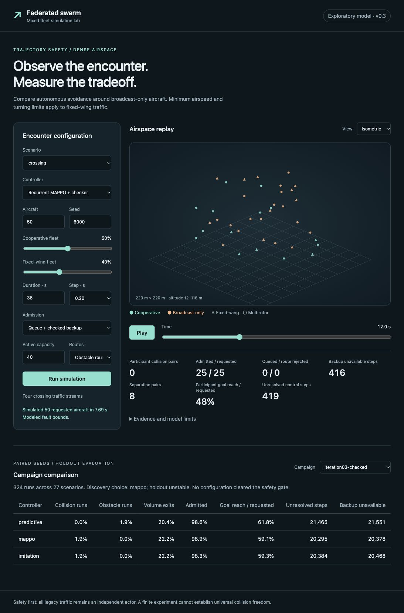

# Admission and recurrent learning: development decision

**No tested configuration passed the empirical safety gate. Do not promote either learned checkpoint as a safer operational controller.** The new pipeline works, but learning did not produce consistent safety gains over the predictive teacher. Admission reduced observed collisions in the density supplement while leaving substantial feasibility, service and timing failures.

All **948 evaluation runs** completed under source SHA-256 `454b8cdae5ed609fa46bcc6e4908c4675f5adefc04e1d759d867fb8e436d953e`. The exact Cartesian configurations, unique run IDs, checkpoint pins, reconstructed summaries and result digests were validated. There are also three strict-terminal diagnostics and 32 final training episodes; these are not counted as holdout evaluation. Preliminary development runs are archived locally and excluded from these results.

## Coverage

Every evaluation uses 40% fixed-wing traffic, 36-second episodes and a 0.2-second step. Environment seed 5000 is discovery; 6000 is holdout. Training uses environment seeds 4000–4007 and independent optimizer seeds 42 and 43.

| Campaign | Scope | Runs |
|---|---|---:|
| [off](off/REPORT.md) | All 27 scenarios, 10/50 aircraft, 50% cooperative, three controllers, all demand enters, direct routes | 324 |
| [checked](checked/REPORT.md) | Same strata; checked entry and static routing, active capacity 40 | 324 |
| [capacity](capacity/REPORT.md) | Crossing/urban/overload/outage-turn, 10/50 aircraft, 50% cooperative, capacity queue and routing | 48 |
| [routes](routes/REPORT.md) | Same four cases, static routing without admission | 48 |
| [seed43](seed43/REPORT.md) | Second optimizer seed, all 27 scenarios at 10 aircraft and 50% cooperative, checked entry and routing | 108 |
| [full-cooperation](full-cooperation/REPORT.md) | Four supplemental cases at 10/50 aircraft, 100% cooperative, checked entry and routing | 48 |
| [scale-off](scale-off/REPORT.md) | Crossing/overload, 100/200 aircraft, 50% cooperative, all demand enters | 24 |
| [scale-checked](scale-checked/REPORT.md) | Same density strata, checked entry, capacity 120 | 24 |

Only the primary pair is evaluated at 50/100/200 aircraft; the second optimizer seed is a limited repeatability check. Each full catalog controller has 54 holdout encounters; each density controller has four. These small, correlated, seeded strata are descriptive evidence, not statistically established safety rates or exhaustive coverage of possible airspace conditions.

## Main holdout comparison

Values below average run-level fractions across the declared strata. Goal reach is against **requested participating demand**, including withheld flights. It includes diagnostic trajectories continuing after collisions and is not successful physical mission completion.

| Entry/routes | Controller | Participant collision runs | Obstacle runs | Volume-exit runs | Admitted | Goal reach |
|---|---|---:|---:|---:|---:|---:|
| All demand/direct | Predictive | 0.0% | 3.7% | 22.2% | 100.0% | 67.3% |
| All demand/direct | Imitation | 0.0% | 1.9% | 27.8% | 100.0% | 59.4% |
| All demand/direct | MAPPO | 0.0% | 1.9% | 35.2% | 100.0% | 58.3% |
| Checked/static routing | Predictive | 0.0% | 1.9% | 20.4% | 98.6% | 61.8% |
| Checked/static routing | Imitation | 1.9% | 0.0% | 22.2% | 98.3% | 59.3% |
| Checked/static routing | MAPPO | 1.9% | 0.0% | 22.2% | 98.9% | 59.1% |

The learned policies each collided in the 50-aircraft sensor-occlusion holdout at 33.8 seconds, after thousands of failed-library decisions in the episode. The predictive teacher had no participant collision in that stratum. A mask constrains admissible proposals; it cannot make an empty maneuver library feasible or guarantee that a different admissible trajectory has a viable continuation later.

Checked catalog failed-library counters were 21,465 for predictive, 20,384 for imitation and 20,295 for MAPPO. Backup-unavailability counters were 21,551, 20,468 and 20,378 respectively. These counters count failed checking attempts: the library fallback and synthetic watchdog may both check the same aircraft in one step. A lower failed-library count alone is not a safety gain.

The second optimizer seed had zero participant-collision runs at 10 aircraft, but volume-exit rates of 14.8% for imitation and 11.1% for MAPPO, with goal reach 78.5% and 77.8%. Its gate still failed. The primary 10-aircraft pair also had zero collisions; the second seed does not establish an improvement or resolve the 50-aircraft counterexample.

## Density supplement

| Entry | Controller | Participant collision runs | Volume-exit runs | Admitted | Goal reach | Mean fleet command p99 |
|---|---|---:|---:|---:|---:|---:|
| All demand | Predictive | 100% | 50% | 100% | 23.5% | 532 ms |
| All demand | Imitation | 100% | 75% | 100% | 18.2% | 535 ms |
| All demand | MAPPO | 100% | 50% | 100% | 18.5% | 525 ms |
| Checked | Predictive | 0% | 25% | 79.8% | 27.0% | 336 ms |
| Checked | Imitation | 0% | 0% | 78.5% | 23.8% | 359 ms |
| Checked | MAPPO | 0% | 0% | 79.5% | 23.2% | 329 ms |

Admission changed airborne exposure and delayed/withheld demand. Consequently, the observed collision reduction does not establish equal-throughput superiority. Checked learned policies avoided exits in these four encounters, but their goal reach, unresolved checks and timing still failed the gate. Catalog and density results do not support a universal controller ordering.

The timing measurements include telemetry, admission, route updates, tactical control and synthetic watchdog work, on an eight-core host with concurrent worker processes. Contention varied during the campaign. They are not isolated-device worst-case execution times. The observed values nevertheless exceed the configured 200 ms step in the density supplement; no real-time guarantee is established.

## Training and limited backup assurance

The primary imitation checkpoint used 3,542 admissible labels and reached about 83.1% teacher agreement on training samples after 12 epochs. This is training fit, not holdout safety or convergence. MAPPO collected 3,527 admissible decisions over eight fine-tuning episodes. The second optimizer seed uses the same expert labels and a separate stochastic MAPPO run. Tensor arrays, metadata and training logs are public under [models](../../models/README.md).

All three strict-terminal admission diagnostics (0%, 40%, 100% fixed-wing) admitted zero of ten requests at the default horizon. A clear nominal brake path does not establish robust terminal-set membership. The static multirotor hover ellipsoid and independent finite path checker are useful foundations, but fixed-wing invariant loiter, indefinitely protected traffic clearance and a joint recursive-feasibility contract remain unimplemented. See [the mathematical scope and implementation](../../docs/third-iteration.md).

The production signed/witnessed tactical audit protocol remains an architecture proposal. Model/result hashes are integrity evidence relative to trusted manifests, not a tamper-proof liability determination.

## Next safety development

Prioritize usable robust terminal/backup continuations for both aircraft types, joint admission/reservation checks that preserve existing continuations, and verified behavior when sensing bounds or deadlines fail. Then profile conservative broad-phase traffic screening and the independent checker so timing improvements preserve the same exclusion bounds. Only after feasibility and service improve should larger randomized curricula, recurrent critic/actor capacity or longer MAPPO training be treated as safety candidates. Keep the current predictive teacher as a research reference and evaluate all policy changes on new held-out seeds and compound faults.

## Reproduce and audit

Run from the repository root after installing the optional learning extra:

```bash
.venv/bin/python -m pip install -e '.[learning]'
./experiments/iteration-03/reproduce.sh
```

Each campaign directory contains its manifest, summary, Markdown/HTML report and compressed **complete** run records (`runs.json.gz`). Larger uncompressed working files remain under ignored `artifacts/`. The validator rejects missing/extra/duplicate configurations, changed checkpoint pins, source mismatch and incorrect reconstructed summaries. [validation.json](validation.json) records the successful audit; [checkpoints.json](checkpoints.json), [checksums.json](checksums.json), [environment.txt](environment.txt) and [simulator-source.tar.gz](simulator-source.tar.gz) preserve provenance. Timing-dependent digests can differ across repeated executions; source, model tensors, strata and physical comparisons must be assessed separately.


